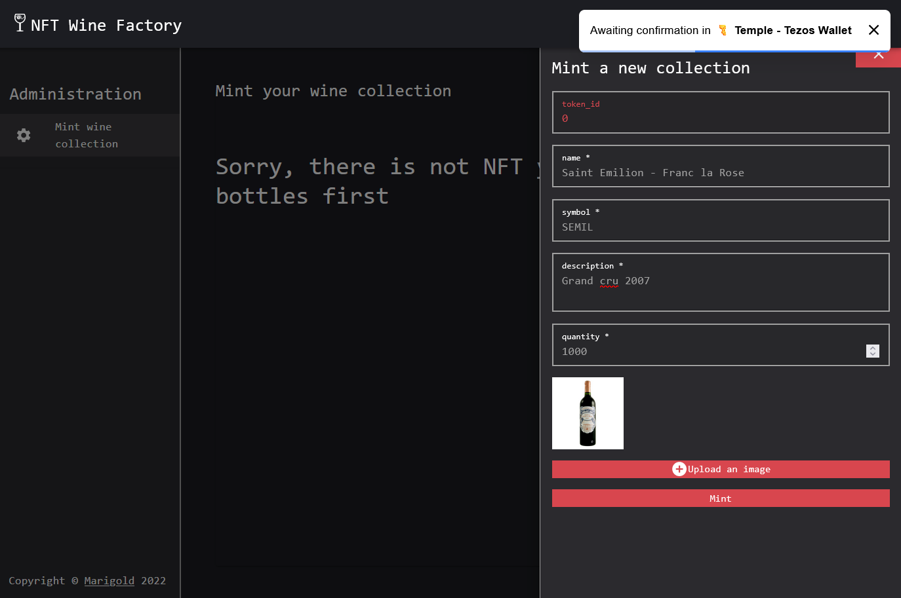
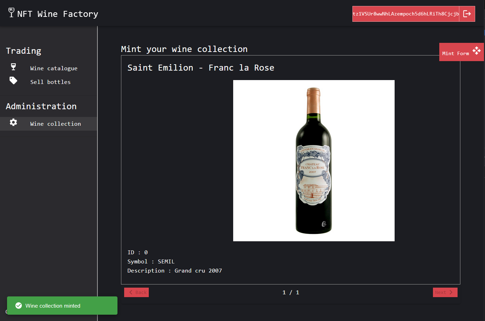
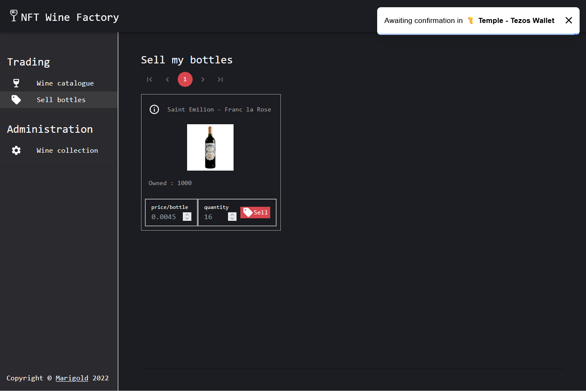
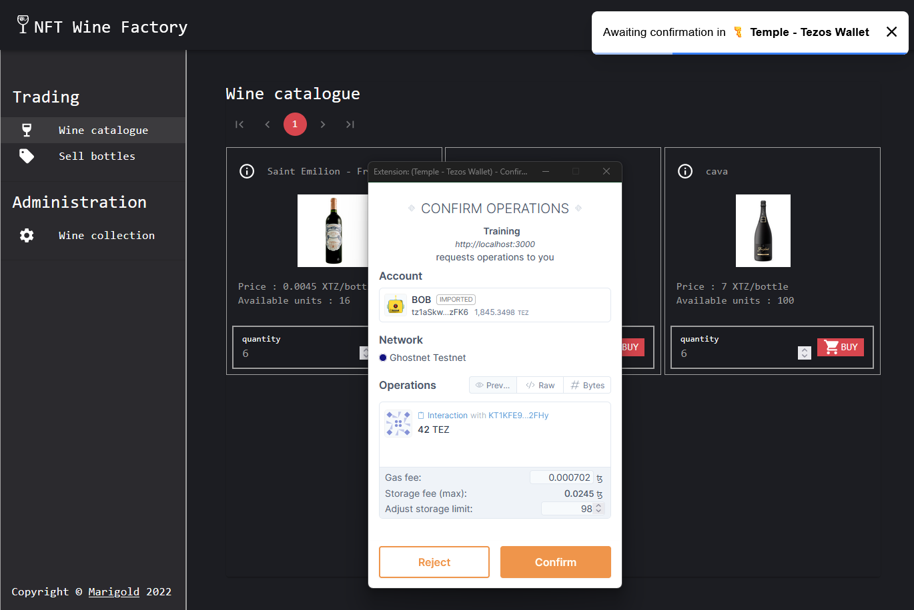

# Wine NFT marketplace

This complete DApp is a Wine marketplace extending the `@ligo/fa` package from the [Ligo repository](https://packages.ligolang.org/)

NFT standard provides these actions :

- transfer
- balance_of
- update_operators

The Wine marketplace is providing these features on top a generic NFT contract :

- mint new wine bottles
- update wine bottle metadata details
- buy wine bottles
- sell wine bottles

You can play with the [final demo](https://demo.winefactory.marigold.dev/)

This DApp is composed by :

- a smart contract extending a ligo library
- a frontend written in React

# Install tooling

- [ ] (Required) [git](https://git-scm.com/) : to clone the repo
- [ ] (Required) [`npm`](https://nodejs.org/en/download/): front-end is a typescript React client app
- [ ] (Recommended) [`yarn`](https://classic.yarnpkg.com/lang/en/docs/install/#windows-stable): to build and run the front-end (see this article for more details about [differences between `npm` and `yarn`](https://www.geeksforgeeks.org/difference-between-npm-and-yarn/))
- [ ] (Required) [Docker](https://docs.docker.com/engine/install/): needed for `taqueria`
- [ ] (Required) [jq](https://stedolan.github.io/jq/download/): extract `taqueria` JSON data
- [ ] (Required) [`taqueria`](https://github.com/ecadlabs/taqueria) : Tezos Dapp project tooling (version >= 0.24.2)
- [ ] (Recommended) [Temple wallet](https://templewallet.com/): an easy to use Tezos wallet in your browser (Or any other one with ghostnet support)

# Install dependencies

This installs dependencies for taqueria, React libs and ligo package

```bash
cd solution
npm i
cd ./app
yarn install
cd ..
TAQ_LIGO_IMAGE=ligolang/ligo:0.57.0 taq ligo --command "install @ligo/fa"
```

# Build

Compile ligo

```bash
TAQ_LIGO_IMAGE=ligolang/ligo:0.57.0 taq compile nft.jsligo
```

Your Michelson files are located on ./artifects folder

# Deploy to ghostnet

```bash
taq deploy nft.tz -e "testing"
```

```logs
┌──────────┬──────────────────────────────────────┬───────┬──────────────────┬────────────────────────────────┐
│ Contract │ Address                              │ Alias │ Balance In Mutez │ Destination                    │
├──────────┼──────────────────────────────────────┼───────┼──────────────────┼────────────────────────────────┤
│ nft.tz   │ KT1ExUVXDmRSk42vJDi37fQdKCDEPS9m2DoB │ nft   │ 0                │ https://ghostnet.ecadinfra.com │
└──────────┴──────────────────────────────────────┴───────┴──────────────────┴────────────────────────────────┘
```

# Run the frontend

```bash
cd ./app
yarn run start
```

You can see the app running on [localhost](http://localhost:3000)

# (Optional) Deploy to mainnet

Later if you need to go to production, you can swap the taqueria environment to point to mainnet. Go back to the root folder `./solution` and run :

```bash
taq deploy nft.tz -e "production"
```

Re-run the frontend to pick the mainnet contract address

```bash
cd ./app
yarn run start
```

Note : we are currently set with the Lima protocol on Taqueria (file .taq/config.json). Later, you would have to change to the last the protocol

```json
"mainnet": {
      "label": "mainnet",
      "rpcUrl": "https://mainnet.api.tez.ie",
      "protocol": "PtLimaPtLMwfNinJi9rCfDPWea8dFgTZ1MeJ9f1m2SRic6ayiwW",
```

# Let's play

1. Connect with your wallet an choose `alice` account (or one of the administrators set on initial storage here `./contracts/nft.storageList.jsligo`). You are redirected to the Administration /mint page as there is no nft minted yet
2. Enter these values on the form for example :

- name : Saint Emilion - Franc la Rose
- symbol : SEMIL
- description : Grand cru 2007
- quantity : 1000

3. Click on `Upload an image` an select a bottle picture on your computer
4. Click on Mint button



Your picture will be pushed to IPFS and will display, then you are asked to sign the mint operation

- Confirm operation
- Wait less than 1 minutes until you get the confirmation notification, the page will refresh automatically



Now you can see the `Trading` menu and the `Sell bottles` sub menu

Click on the sub-menu entry

You are owner of this bottle so you can make an offer on it

- Enter a quantity
- Enter a price offer
- Click on `SELL` button
- Wait a bit for the confirmation, then it refreshes and you have an offer attached to your NFT



For buying,

- Disconnect from your user and connect with another account (who has enough XTZ to buy at least 1 bottle)
- The logged buyer can see that alice is selling some bottles from the unique collection
- Buy some bottles while clicking on `BUY` button
- Wait for the confirmation, then the offer is updated on the market (depending how many bottle you bought)
- Click on `bottle offers` sub menu
- You are now the owner of some bottles, you can resell a part of it at your own price, etc ...



For adding more collections, go to the Mint page and repeat the process

# Conclusion

You are able to play with an any NFT template from the ligo library.

Congratulations !

You can freely modify this example to fit your need
